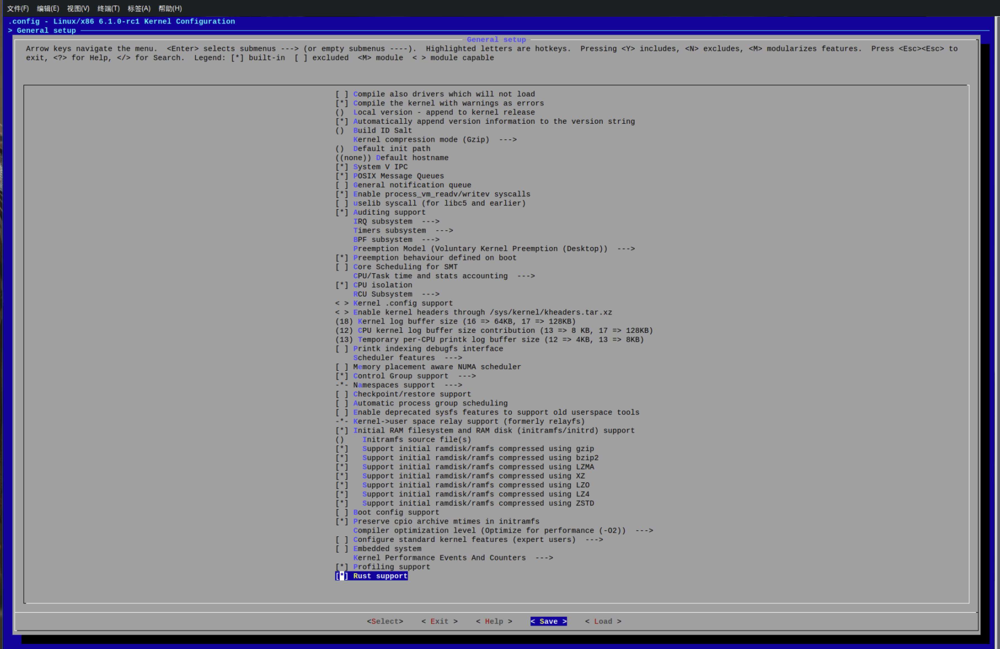

# 作业1: 编译Linux内核

## 配置

```shell
make x86_64_defconfig
make LLVM=1 menuconfig
#set the following config to yes
General setup
        ---> [*] Rust support

```



## 编译
```shell 
make LLVM=1 -j$(nproc)
```


生成 vmlinux 文件


