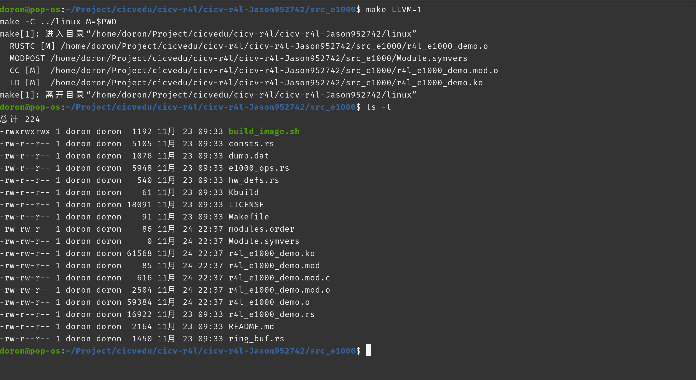
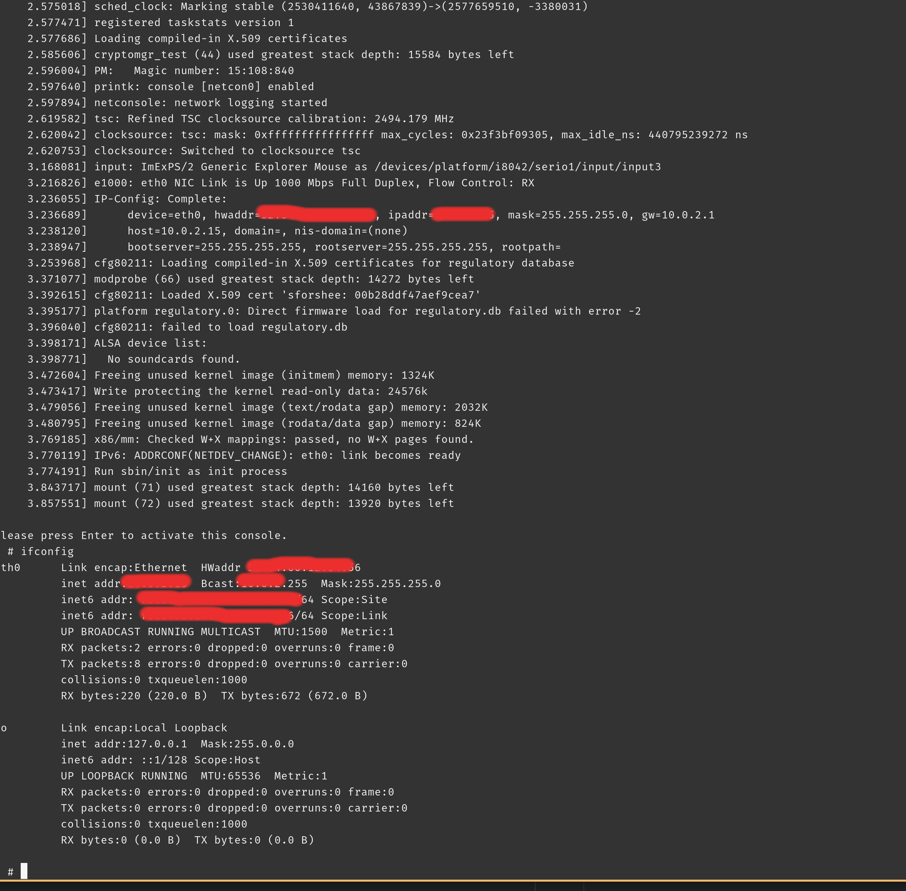
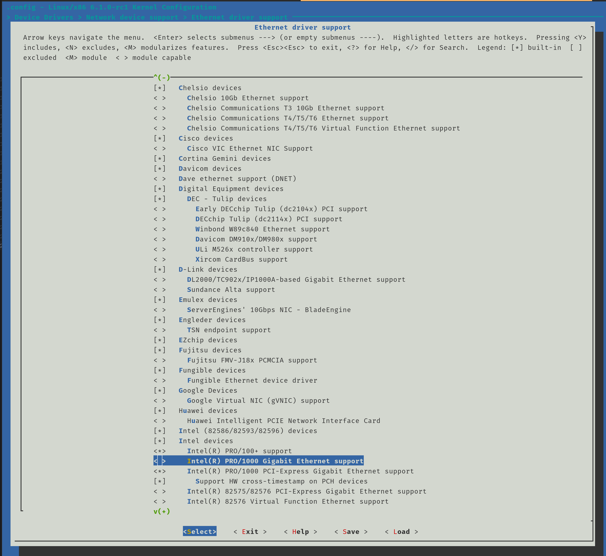
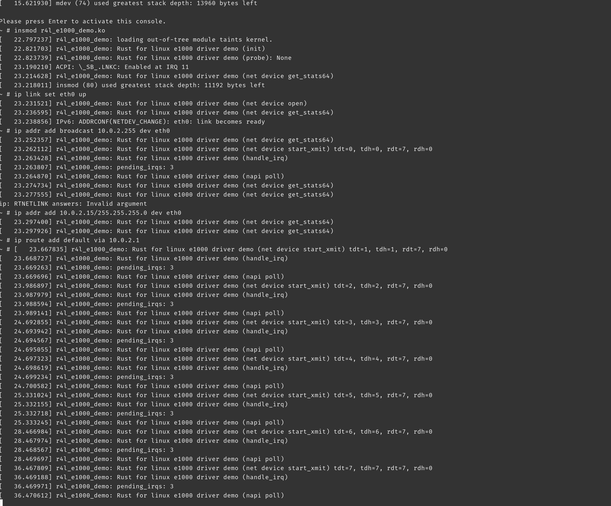
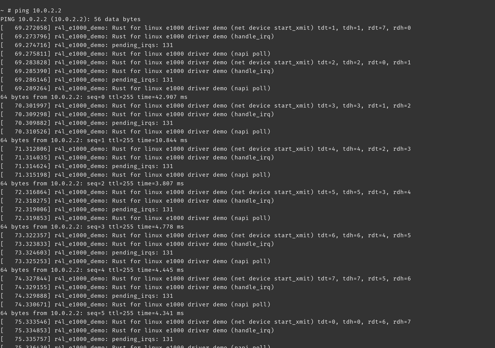

# 作业2: 对Linux内核进行一些配置

## 编译成内核模块

```bash
make LLVM=1
```



## 测试运行

```bash
chmod 777 ./build_image.sh
./build_image.sh
```

启动后按回车，进入系统，然后运行以下命令：

```bash
ifconfig
```



## 禁用默认网卡



## 重新编译内核, 重新运行./build_image.sh

## 手动配置

```bash
insmod r4l_e1000_demo.ko
ip link set eth0 up
ip addr add broadcast 10.0.2.255 dev eth0
ip addr add 10.0.2.15/255.255.255.0 dev eth0 
ip route add default via 10.0.2.1
```



```bash
ping 10.0.2.2
```



## 问题

1. 编译成内核模块，是在哪个文件中以哪条语句定义的?
   定义在文件 Kbuild 中的
   ```
   obj-m := r4l_e1000_demo.o
   ```
   
2. 该模块位于独立的文件夹内，却能编译成Linux内核模块，这叫做out-of-tree module，请分析它是如何与内核代码产生联系的？
  ```bash
  $(MAKE) -C $(KDIR) M=$$PWD
  ```
  首先， －C参数指定linux内核， M 指定驱动源码位置，内核的 Makefile检查M是否为空，如非空则编译此模块为外部模块

