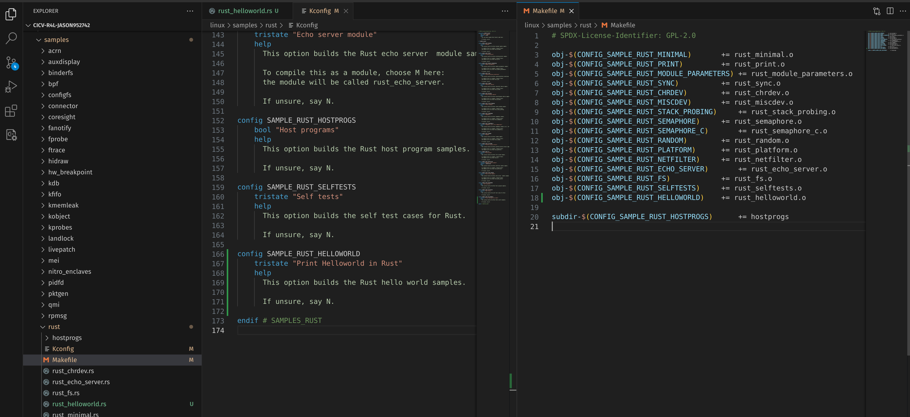
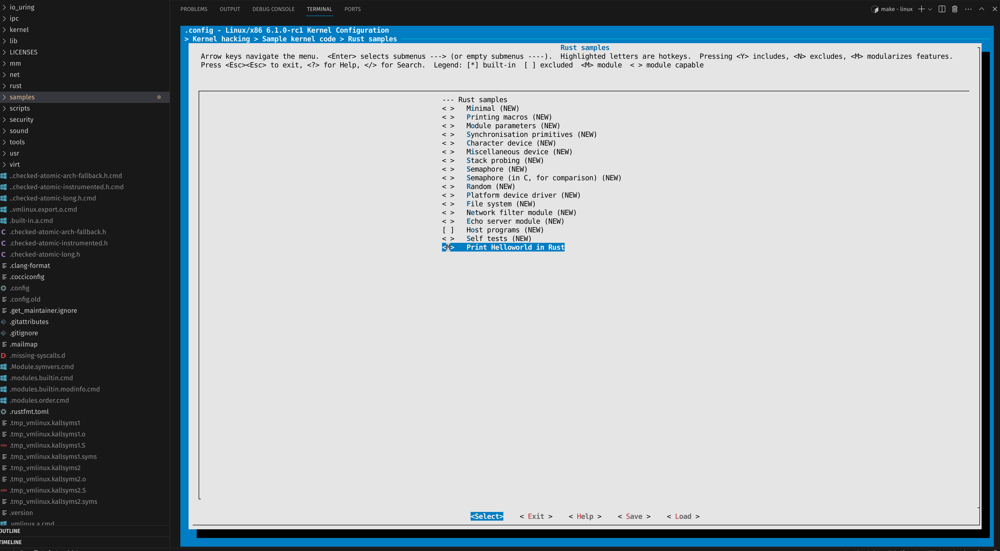
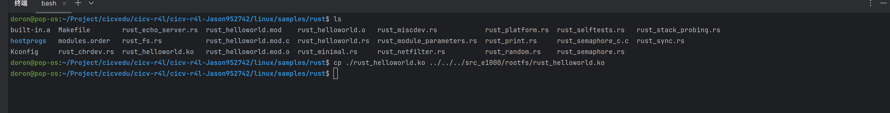
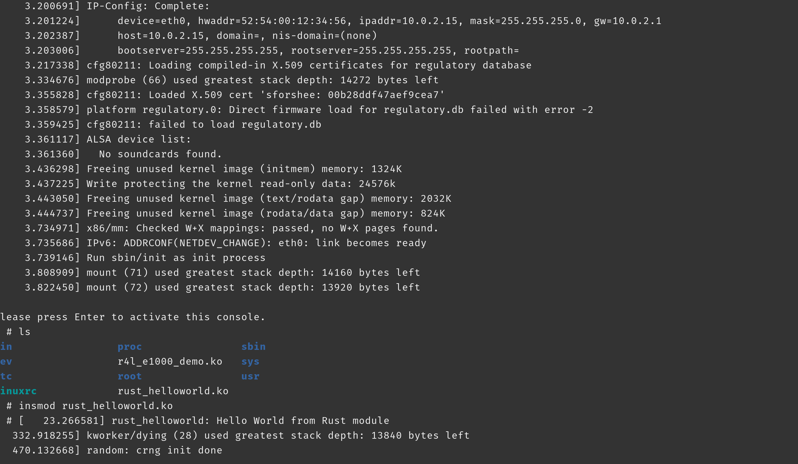

# 作业3


## 进入到Linux目录下samples/rust文件夹, 添加一个rust_helloworld.rs文件:

```rust
// SPDX-License-Identifier: GPL-2.0
//! Rust minimal sample.
      
use kernel::prelude::*;
      
module! {
  type: RustHelloWorld,
  name: "rust_helloworld",
  author: "whocare",
  description: "hello world module in rust",
  license: "GPL",
}
      
struct RustHelloWorld {}
      
impl kernel::Module for RustHelloWorld {
  fn init(_name: &'static CStr, _module: &'static ThisModule) -> Result<Self> {
      pr_info!("Hello World from Rust module");
      Ok(RustHelloWorld {})
  }
}

```

## 修改samples/rust下的Makefile和Kconfig



## 更改该模块的配置，使之编译成模块



## 重新编译该内核, 生成 rust_helloworld.ko, 并复制到src_1000/rootfs目录下



## 重新跑build_image.sh, 使用insmod命令进行安装该模块


