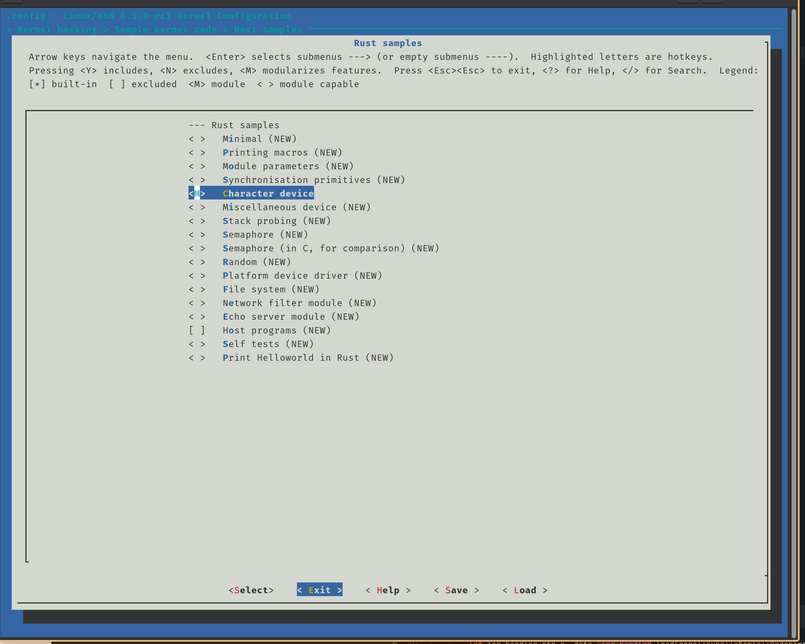
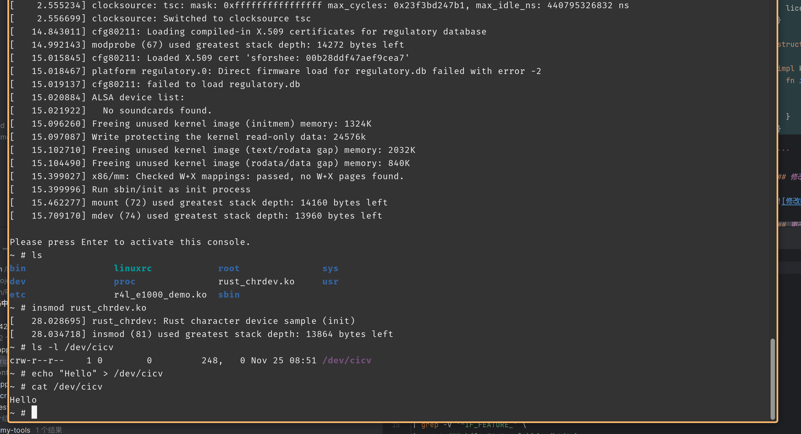

# 作业5: 注册字符设备


## 更改配置



## 运行build_image.sh脚本

## 往字符设备写入内容




### 字符设备/dev/cicv是怎么创建的？它的设备号是多少？它是如何与我们写的字符设备驱动关联上的？

首先，在 build_image.sh文件中， 第27行有以下语句：

```sh
echo "mknod /dev/cicv c 248 0" >> etc/init.d/rcS
```

这里把 `mknod /dev/cicv c 248 0` 这个创建节点的语句传给 `/etc/init.d/rcS` 这个启动脚本，在系统引导时，就自动创建了 /dev/cicv这个设备节点， 其中 主设备号为 248， 次设备号为 0.

设备和驱动通过以下代码进行关联:
```rust
    fn init(name: &'static CStr, module: &'static ThisModule) -> Result<Self> {
        pr_info!("Rust character device sample (init)\n");

        let mut chrdev_reg = chrdev::Registration::new_pinned(name, 0, module)?;

        // Register the same kind of device twice, we're just demonstrating
        // that you can use multiple minors. There are two minors in this case
        // because its type is `chrdev::Registration<2>`
        chrdev_reg.as_mut().register::<RustFile>()?;
        chrdev_reg.as_mut().register::<RustFile>()?;

        Ok(RustChrdev { _dev: chrdev_reg })
    }
```