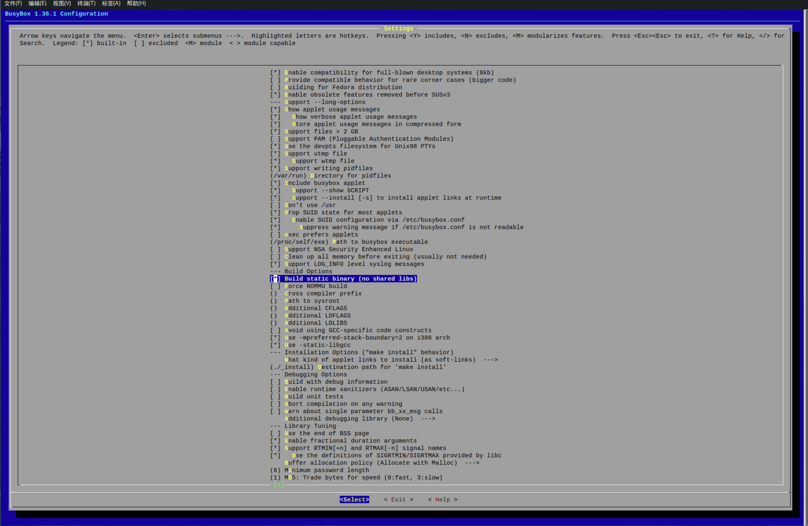
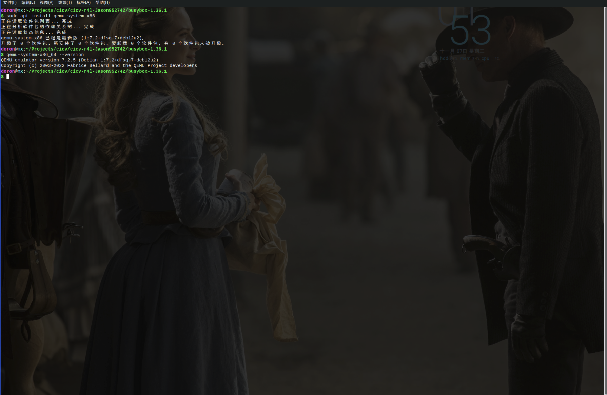

# 实验环境搭建

## 环境配置

### 安装编译相关工具、库等

```shell
sudo apt install \
  build-essential libtool texinfo \
  gzip zip unzip patchutils \
  cmake ninja-build automake bison flex gperf \
  grep sed gawk bc \
  zlib1g-dev libexpat1-dev libmpc-dev libncurses-dev \
  libglib2.0-dev libfdt-dev libpixman-1-dev libelf-dev libssl-dev
```


### 安装Rust
```shell
curl --proto '=https' --tlsv1.2 -sSf https://sh.rustup.rs | sh
```


### 安装LLVM

```shell
sudo apt-get install clang-format clang-tidy clang-tools clang clangd libc++-dev libc++1 libc++abi-dev libc++abi1 libclang-dev libclang1 liblldb-dev libllvm-ocaml-dev libomp-dev libomp5 lld lldb llvm python3-clang
```


## 代码仓库配置

### 拉取项目
配置git, 在github中添加 ssh key, 将 项目拉取下来

### 配置BusyBox

配置
```shell
# 进入源代码目录
cd busybox-1.36.1
# 启动menuconfig进行配置
make menuconfig
# 在Settings项中，将"Build static binary (no shared libs)"选中
Settings
          ---> [*] Build static binary (no shared libs)
# 退出
```


编译和安装 BusyBox
```shell
make install -j$(nproc)
```


### 安装 Qemu

```shell
sudo apt install qemu-system-x86
qemu-system-x86_64 --version
```



### 配置Linux文件夹

为了让Linux内核代码能够支持Rust，进行以下相关的配置:

```shell
cd linux
# 将此目录中的rustc重置为特定版本
# 可提前为rustup设置代理，以便加速下载过程，参考上一节“安装Rust”中的说明
rustup override set $(scripts/min-tool-version.sh rustc)
# 添加rust-src源代码
rustup component add rust-src
# 安装clang llvm，该项一般在配置内核时已经安装，若已安装此处可忽略
apt install clang llvm

# 可为cargo仓库crates.io设置使用镜像，参考上一节“安装Rust”中的说明
# 安装bindgen工具，注意在0.60版本后，bindgen工具的命令行版本位于bindgen-cli包中
cargo install --locked --version $(scripts/min-tool-version.sh bindgen) bindgen
# 安装rustfmt和clippy
rustup component add rustfmt
rustup component add clippy
# 检查内核rust支持已经启用
make LLVM=1 rustavailable
```

